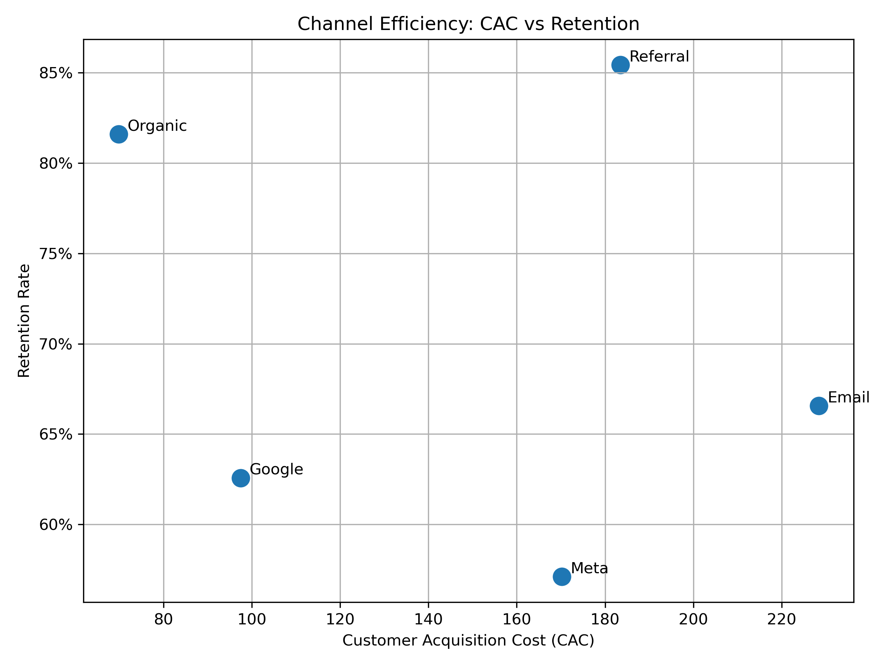

# Subscription Growth, Retention, and CAC Analysis

## Business Context

The company is investing across multiple acquisition channels including Google, Meta, Email, Organic, and Referral.

Leadership wants to understand:

* Which channels generate high quality subscribers
* Where conversion funnels break down
* How retention differs by channel
* Whether marketing spend is efficiently allocated

The goal is to identify where to scale investment and where to reduce spend.

---

## Data Overview

The analysis uses three core tables:

**Users**

* user_id
* signup_date
* acquisition_channel

**Subscriptions**

* user_id
* subscription_start_date
* plan_type
* monthly_price
* status (active or churned)

**Marketing Spend**

* date
* channel
* spend

---

## Metrics Defined

* Conversion Rate = subscribers / total signups
* Retention Rate = active subscribers / total subscribers
* Churn Rate = churned subscribers / total subscribers
* Customer Acquisition Cost (CAC) = total marketing spend / total subscribers

---

## Key Findings

* Organic traffic drives the highest conversion rate at 24.5 percent
* Referral users show the strongest retention at 85.4 percent
* Meta has the lowest conversion rate and highest churn rate
* Organic has the lowest CAC at approximately 70 dollars
* Paid social channels have significantly higher CAC and weaker retention

---

## Business Recommendations

* Increase investment in Organic growth initiatives
* Scale Referral programs but optimize cost structure
* Reevaluate Meta targeting or reduce budget allocation
* Improve Email lifecycle campaigns to increase retention
* Shift budget toward high retention channels rather than high volume channels

---

## Skills Demonstrated

* SQL aggregation and joins
* Funnel analysis
* Retention and churn modeling
* CAC calculation
* Business driven interpretation of metrics
* Data visualization and executive communication

---

## Projected Revenue Impact

Reallocating 100,000 dollars from Meta (CAC ≈ 170) to Organic (CAC ≈ 70) would:

* Increase acquired subscribers from approximately 588 to 1,428
* Generate an additional 840 subscribers

Assuming 50 dollars in monthly revenue per subscriber, this shift could generate approximately 42,000 dollars in additional monthly recurring revenue, or over 500,000 dollars annually.

This highlights how channel optimization directly impacts long term profitability.

